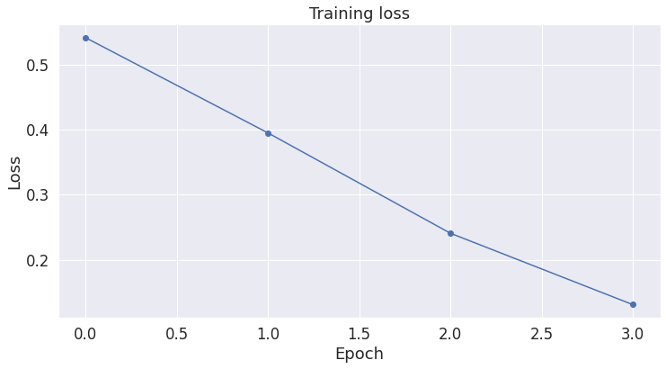
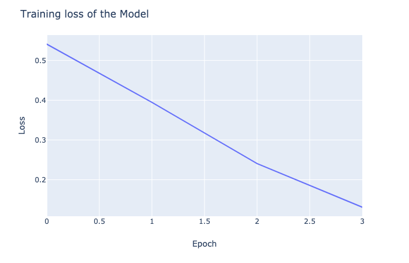

```python
import sentencepiece as spm
import transformers
print(transformers.__version__)
import torch
import tokenizers
from nlp import load_dataset
from transformers import AlbertTokenizer, AlbertModel, BertTokenizer, AlbertForPreTraining

FROM_PRETRAINED = False

device = "cuda" if torch.cuda.is_available() else "cpu"
#device = "cpu"
torch.device(device)

#dataset_f = "oscar.eo.txt" # file that contains the dataset
""" IF  YOU WANT TO TRAIN A NEW TOKENIZER """
# spm.SentencePieceTrainer.train(input=dataset_f, model_prefix="tokenizer", vocab_size=30000)
""" IF  YOU WANT TO USE PRETRAINED """
#tokenizer = AlbertTokenizer.from_pretrained("albert-base-v1")
""" IF  YOU ALREADY HAVE ONE WORDPIECE VOCAB LIST"""
tokenizer = BertTokenizer(vocab_file="./bert-large-uncased-vocab.txt", do_basic_tokenize=False)

from transformers import AlbertConfig, AlbertModel, AlbertForMaskedLM

albert_base_configuration = AlbertConfig(
    hidden_size=768,
    num_attention_heads=12,
    intermediate_size=3072,
    vocab_size=tokenizer.vocab_size)

if FROM_PRETRAINED:
    model = AlbertForMaskedLM.from_pretrained(
        'albert-base-v1', return_dict=True)
else:
    model = AlbertForPreTraining(config=albert_base_configuration)

configuration = model.config

print(configuration)

```

    4.1.1
    AlbertConfig {
      "attention_probs_dropout_prob": 0,
      "bos_token_id": 2,
      "classifier_dropout_prob": 0.1,
      "embedding_size": 128,
      "eos_token_id": 3,
      "hidden_act": "gelu_new",
      "hidden_dropout_prob": 0,
      "hidden_size": 768,
      "initializer_range": 0.02,
      "inner_group_num": 1,
      "intermediate_size": 3072,
      "layer_norm_eps": 1e-12,
      "max_position_embeddings": 512,
      "model_type": "albert",
      "num_attention_heads": 12,
      "num_hidden_groups": 1,
      "num_hidden_layers": 12,
      "pad_token_id": 0,
      "position_embedding_type": "absolute",
      "type_vocab_size": 2,
      "vocab_size": 30522
    }


```python
""" LOAD A PLAIN TEXT FILE AS DATASET """
from transformers import LineByLineTextDataset, LineByLineWithSOPTextDataset
import pickle
from os import path

transformers.logging.set_verbosity_debug()

file_dir = "./oscar"
file_path = file_dir + "/oscar.eo.txt"

if not path.exists(file_path + ".pkl"):
    dataset = LineByLineWithSOPTextDataset(
        tokenizer=tokenizer,
        file_dir=file_dir,
        block_size=128,
    )
    dump_file = open(file_path + ".pkl", 'wb')
    pickle.dump(dataset, dump_file, -1)

dump_file = open(file_path + ".pkl", 'rb')


dump_file = open(file_path + ".pkl", 'rb')
dataset = pickle.load(dump_file)

dataset
```


    <transformers.data.datasets.language_modeling.LineByLineWithSOPTextDataset at 0x7f73f415f0f0>


```python
from transformers import DataCollatorForSOP

#data_collator = DataCollatorForSOP(tokenizer=tokenizer)
data_collator2 = DataCollatorForSOP()
data_collator2.tokenizer = tokenizer
```

    /home/qylin/.local/lib/python3.6/site-packages/transformers/data/data_collator.py:450: FutureWarning: DataCollatorForSOP is deprecated and will be removed in a future version, you can now use DataCollatorForLanguageModeling instead.
      FutureWarning,


```python
from transformers import Trainer, TrainingArguments

training_args = TrainingArguments(
    output_dir="./albert_output",
    overwrite_output_dir=True,
    num_train_epochs=1,
    save_steps=10000,
    save_total_limit=2,
    per_gpu_train_batch_size=32,
)

trainer = Trainer(
    model=model,
    args=training_args,
    data_collator=data_collator2,
    train_dataset=dataset,
)


```

    PyTorch: setting up devices


```python
trainer.train()
```

    Using deprecated `--per_gpu_train_batch_size` argument which will be removed in a future version. Using `--per_device_train_batch_size` is preferred.
    Using deprecated `--per_gpu_train_batch_size` argument which will be removed in a future version. Using `--per_device_train_batch_size` is preferred.
    ***** Running training *****
      Num examples = 110027
      Num Epochs = 1
      Instantaneous batch size per device = 8
      Total train batch size (w. parallel, distributed & accumulation) = 32
      Gradient Accumulation steps = 1
      Total optimization steps = 3439
    Using deprecated `--per_gpu_train_batch_size` argument which will be removed in a future version. Using `--per_device_train_batch_size` is preferred.


    <div>
        <style>
            /* Turns off some styling */
            progress {
                /* gets rid of default border in Firefox and Opera. */
                border: none;
                /* Needs to be in here for Safari polyfill so background images work as expected. */
                background-size: auto;
            }
        </style>

      <progress value='3439' max='3439' style='width:300px; height:20px; vertical-align: middle;'></progress>
      [3439/3439 24:52, Epoch 1/1]
    </div>
    <table border="1" class="dataframe">
  <thead>
    <tr style="text-align: left;">
      <th>Step</th>
      <th>Training Loss</th>
    </tr>
  </thead>
  <tbody>
    <tr>
      <td>500</td>
      <td>8.702103</td>
    </tr>
    <tr>
      <td>1000</td>
      <td>6.757881</td>
    </tr>
    <tr>
      <td>1500</td>
      <td>6.533456</td>
    </tr>
    <tr>
      <td>2000</td>
      <td>6.494463</td>
    </tr>
    <tr>
      <td>2500</td>
      <td>6.476659</td>
    </tr>
    <tr>
      <td>3000</td>
      <td>6.468911</td>
    </tr>
  </tbody>
</table><p>


    Training completed. Do not forget to share your model on huggingface.co/models =)


    TrainOutput(global_step=3439, training_loss=6.8479398620374745)


```python
torch.cuda.empty_cache()
trainer.save_model("./albert_output")
```

# Fine-tuning


```python
import wget
import os

print('Downloading dataset...')

# The URL for the dataset zip file.
url = 'https://nyu-mll.github.io/CoLA/cola_public_1.1.zip'

# Download the file (if we haven't already)
if not os.path.exists('./cola_public_1.1.zip'):
    wget.download(url, './cola_public_1.1.zip')
```

    Downloading dataset...


## Prepare dataset


```python
# Unzip the dataset (if we haven't already)
if not os.path.exists('./cola_public/'):
    !unzip cola_public_1.1.zip
```


```python
import pandas as pd

# Load the dataset into a pandas dataframe.
df = pd.read_csv("./cola_public/raw/in_domain_train.tsv", delimiter='\t', header=None, names=['sentence_source', 'label', 'label_notes', 'sentence'])

# Report the number of sentences.
print('Number of training sentences: {:,}\n'.format(df.shape[0]))

# Display 10 random rows from the data.
df.sample(10)
```

    Number of training sentences: 8,551


<div>
<style scoped>
    .dataframe tbody tr th:only-of-type {
        vertical-align: middle;
    }

    .dataframe tbody tr th {
        vertical-align: top;
    }

    .dataframe thead th {
        text-align: right;
    }
</style>
<table border="1" class="dataframe">
  <thead>
    <tr style="text-align: right;">
      <th></th>
      <th>sentence_source</th>
      <th>label</th>
      <th>label_notes</th>
      <th>sentence</th>
    </tr>
  </thead>
  <tbody>
    <tr>
      <th>2389</th>
      <td>l-93</td>
      <td>1</td>
      <td>NaN</td>
      <td>Angela characterized Shelly as a lifesaver.</td>
    </tr>
    <tr>
      <th>5048</th>
      <td>ks08</td>
      <td>1</td>
      <td>NaN</td>
      <td>They're not finding it a stress being in the s...</td>
    </tr>
    <tr>
      <th>3133</th>
      <td>l-93</td>
      <td>0</td>
      <td>*</td>
      <td>Paul exhaled on Mary.</td>
    </tr>
    <tr>
      <th>5955</th>
      <td>c_13</td>
      <td>0</td>
      <td>*</td>
      <td>I ordered if John drink his beer.</td>
    </tr>
    <tr>
      <th>625</th>
      <td>bc01</td>
      <td>1</td>
      <td>NaN</td>
      <td>Press the stamp against the pad completely.</td>
    </tr>
    <tr>
      <th>3542</th>
      <td>ks08</td>
      <td>0</td>
      <td>*</td>
      <td>They can very.</td>
    </tr>
    <tr>
      <th>6915</th>
      <td>m_02</td>
      <td>1</td>
      <td>NaN</td>
      <td>This arch is supporting the weight of the tower.</td>
    </tr>
    <tr>
      <th>2908</th>
      <td>l-93</td>
      <td>1</td>
      <td>NaN</td>
      <td>That new handle detaches easily.</td>
    </tr>
    <tr>
      <th>5857</th>
      <td>c_13</td>
      <td>1</td>
      <td>NaN</td>
      <td>The Brazilians pumped the oil across the river.</td>
    </tr>
    <tr>
      <th>4191</th>
      <td>ks08</td>
      <td>1</td>
      <td>NaN</td>
      <td>It is a wooden desk.</td>
    </tr>
  </tbody>
</table>
</div>


```python
df.loc[df.label == 0].sample(5)[['sentence', 'label']]

```


<div>
<style scoped>
    .dataframe tbody tr th:only-of-type {
        vertical-align: middle;
    }

    .dataframe tbody tr th {
        vertical-align: top;
    }

    .dataframe thead th {
        text-align: right;
    }
</style>
<table border="1" class="dataframe">
  <thead>
    <tr style="text-align: right;">
      <th></th>
      <th>sentence</th>
      <th>label</th>
    </tr>
  </thead>
  <tbody>
    <tr>
      <th>6770</th>
      <td>We realised that Dr Jones died because he ate ...</td>
      <td>0</td>
    </tr>
    <tr>
      <th>1652</th>
      <td>Here's a pole for you to kiss the girl who tie...</td>
      <td>0</td>
    </tr>
    <tr>
      <th>3258</th>
      <td>Jennifer baked at the potatoes.</td>
      <td>0</td>
    </tr>
    <tr>
      <th>4651</th>
      <td>Kim is resembled by the model in nearly every ...</td>
      <td>0</td>
    </tr>
    <tr>
      <th>2672</th>
      <td>The book sent to Peter.</td>
      <td>0</td>
    </tr>
  </tbody>
</table>
</div>


```python
# Get the lists of sentences and their labels.
sentences = df.sentence.values
labels = df.label.values

sentences
```


    array(["Our friends won't buy this analysis, let alone the next one we propose.",
           "One more pseudo generalization and I'm giving up.",
           "One more pseudo generalization or I'm giving up.", ...,
           'It is easy to slay the Gorgon.',
           'I had the strangest feeling that I knew you.',
           'What all did you get for Christmas?'], dtype=object)


###  Tokenization & Input Formatting


```python
tokenizer = AlbertTokenizer.from_pretrained('albert-base-v2',do_lower_case=True)
```

    loading file https://huggingface.co/albert-base-v2/resolve/main/spiece.model from cache at /home/qylin/.cache/huggingface/transformers/10be6ce6d3508f1fdce98a57a574283b47c055228c1235f8686f039287ff8174.d6110e25022b713452eb83d5bfa8ae64530995a93d8e694fe52e05aa85dd3a7d


```python
# Print the original sentence.
print(' Original: ', sentences[0])

# Print the sentence split into tokens.
print('Tokenized: ', tokenizer.tokenize(sentences[0]))

# Print the sentence mapped to token ids.
print('Token IDs: ', tokenizer.convert_tokens_to_ids(tokenizer.tokenize(sentences[0])))

```

     Original:  Our friends won't buy this analysis, let alone the next one we propose.
    Tokenized:  ['▁our', '▁friends', '▁won', "'", 't', '▁buy', '▁this', '▁analysis', ',', '▁let', '▁alone', '▁the', '▁next', '▁one', '▁we', '▁propose', '.']
    Token IDs:  [318, 954, 230, 22, 38, 3034, 48, 2495, 15, 408, 1056, 14, 328, 53, 95, 17873, 9]


```python
# tokenizer_albert = AlbertTokenizer.from_pretrained('albert-base-v2')

```


```python
# Print the original sentence.
print(' Original: ', sentences[0])

# Print the sentence split into tokens.
print('Tokenized: ', tokenizer.tokenize(sentences[0]))

# Print the sentence mapped to token ids.
print('Token IDs: ', tokenizer.convert_tokens_to_ids(tokenizer.tokenize(sentences[0])))
```

     Original:  Our friends won't buy this analysis, let alone the next one we propose.
    Tokenized:  ['▁our', '▁friends', '▁won', "'", 't', '▁buy', '▁this', '▁analysis', ',', '▁let', '▁alone', '▁the', '▁next', '▁one', '▁we', '▁propose', '.']
    Token IDs:  [318, 954, 230, 22, 38, 3034, 48, 2495, 15, 408, 1056, 14, 328, 53, 95, 17873, 9]


```python
input_ids = []

# For every sentence...
for sent in sentences:
    # `encode` will:
    #   (1) Tokenize the sentence.
    #   (2) Prepend the `[CLS]` token to the start.
    #   (3) Append the `[SEP]` token to the end.
    #   (4) Map tokens to their IDs.
    encoded_sent = tokenizer.encode(
                        sent,                      # Sentence to encode.
                        add_special_tokens = True, # Add '[CLS]' and '[SEP]'

                        # This function also supports truncation and conversion
                        # to pytorch tensors, but we need to do padding, so we
                        # can't use these features :( .
                        #max_length = 128,          # Truncate all sentences.
                        #return_tensors = 'pt',     # Return pytorch tensors.
                   )

    # Add the encoded sentence to the list.
    input_ids.append(encoded_sent)

# Print sentence 0, now as a list of IDs.
print('Original: ', sentences[0])
print('Token IDs:', input_ids[0])
```

    Original:  Our friends won't buy this analysis, let alone the next one we propose.
    Token IDs: [2, 318, 954, 230, 22, 38, 3034, 48, 2495, 15, 408, 1056, 14, 328, 53, 95, 17873, 9, 3]


### Padding & Truncating


```python
print('Max sentence length: ', max([len(sen) for sen in input_ids]))

```

    Max sentence length:  46


```python
# We'll borrow the `pad_sequences` utility function to do this.
from keras.preprocessing.sequence import pad_sequences

# Set the maximum sequence length.
# I've chosen 64 somewhat arbitrarily. It's slightly larger than the
# maximum training sentence length of 47...
MAX_LEN = 64

print('\nPadding/truncating all sentences to %d values...' % MAX_LEN)

print('\nPadding token: "{:}", ID: {:}'.format(tokenizer.pad_token, tokenizer.pad_token_id))

# Pad our input tokens with value 0.
# "post" indicates that we want to pad and truncate at the end of the sequence,
# as opposed to the beginning.
input_ids = pad_sequences(input_ids, maxlen=MAX_LEN, dtype="long",
                          value=0, truncating="post", padding="post")

print('\nDone.')

```


    Padding/truncating all sentences to 64 values...

    Padding token: "<pad>", ID: 0

    Done.


### Attention Masks


```python
# Create attention masks
attention_masks = []

# For each sentence...
for sent in input_ids:

    # Create the attention mask.
    #   - If a token ID is 0, then it's padding, set the mask to 0.
    #   - If a token ID is > 0, then it's a real token, set the mask to 1.
    att_mask = [int(token_id > 0) for token_id in sent]

    # Store the attention mask for this sentence.
    attention_masks.append(att_mask)
```

### Training & Validation Split


```python
# Use train_test_split to split our data into train and validation sets for
# training
from sklearn.model_selection import train_test_split

# Use 90% for training and 10% for validation.
train_inputs, validation_inputs, train_labels, validation_labels = train_test_split(input_ids, labels,
                                                            random_state=2018, test_size=0.1)
# Do the same for the masks.
train_masks, validation_masks, _, _ = train_test_split(attention_masks, labels,
                                             random_state=2018, test_size=0.1)
```

### Converting to PyTorch Data Types


```python
# Convert all inputs and labels into torch tensors, the required datatype
# for our model.
train_inputs = torch.tensor(train_inputs)
validation_inputs = torch.tensor(validation_inputs)

train_labels = torch.tensor(train_labels)
validation_labels = torch.tensor(validation_labels)

train_masks = torch.tensor(train_masks)
validation_masks = torch.tensor(validation_masks)

```


```python
from torch.utils.data import TensorDataset, DataLoader, RandomSampler, SequentialSampler

# The DataLoader needs to know our batch size for training, so we specify it
# here.
# For fine-tuning BERT on a specific task, the authors recommend a batch size of
# 16 or 32.

batch_size = 32

# Create the DataLoader for our training set.
train_data = TensorDataset(train_inputs, train_masks, train_labels)
train_sampler = RandomSampler(train_data)
train_dataloader = DataLoader(train_data, sampler=train_sampler, batch_size=batch_size)

# Create the DataLoader for our validation set.
validation_data = TensorDataset(validation_inputs, validation_masks, validation_labels)
validation_sampler = SequentialSampler(validation_data)
validation_dataloader = DataLoader(validation_data, sampler=validation_sampler, batch_size=batch_size)
```

## Train Our Classification Model

#### Load the model we trained above


```python
from transformers import AlbertForSequenceClassification

use_fine_tuned_model = True

if use_fine_tuned_model != True:
    model = AlbertForSequenceClassification.from_pretrained('./albert_output',    
                                                        num_labels = 2, # The number of output labels--2 for binary classification.
                                                        # You can increase this for multi-class tasks.   
                                                        output_attentions = False, # Whether the model returns attentions weights.
                                                        output_hidden_states = False # Whether the model returns all hidden-states.
                                                       )
else:
    model = AlbertForSequenceClassification.from_pretrained('albert-base-v2',    
                                                        num_labels = 2, # The number of output labels--2 for binary classification.
                                                        # You can increase this for multi-class tasks.   
                                                        output_attentions = False, # Whether the model returns attentions weights.
                                                        output_hidden_states = False # Whether the model returns all hidden-states.
                                                       )

model.cuda()

```

    loading configuration file https://huggingface.co/albert-base-v2/resolve/main/config.json from cache at /home/qylin/.cache/huggingface/transformers/e48be00f755a5f765e36a32885e8d6a573081df3321c9e19428d12abadf7dba2.b8f28145885741cf994c0e8a97b724f6c974460c297002145e48e511d2496e88
    Model config AlbertConfig {
      "architectures": [
        "AlbertForMaskedLM"
      ],
      "attention_probs_dropout_prob": 0,
      "bos_token_id": 2,
      "classifier_dropout_prob": 0.1,
      "down_scale_factor": 1,
      "embedding_size": 128,
      "eos_token_id": 3,
      "gap_size": 0,
      "hidden_act": "gelu_new",
      "hidden_dropout_prob": 0,
      "hidden_size": 768,
      "initializer_range": 0.02,
      "inner_group_num": 1,
      "intermediate_size": 3072,
      "layer_norm_eps": 1e-12,
      "max_position_embeddings": 512,
      "model_type": "albert",
      "net_structure_type": 0,
      "num_attention_heads": 12,
      "num_hidden_groups": 1,
      "num_hidden_layers": 12,
      "num_memory_blocks": 0,
      "pad_token_id": 0,
      "position_embedding_type": "absolute",
      "type_vocab_size": 2,
      "vocab_size": 30000
    }

    loading weights file https://huggingface.co/albert-base-v2/resolve/main/pytorch_model.bin from cache at /home/qylin/.cache/huggingface/transformers/bf1986d976e9a8320cbd3a0597e610bf299d639ce31b7ca581cbf54be3aaa6d3.d6d54047dfe6ae844e3bf6e7a7d0aff71cb598d3df019361e076ba7639b1da9b
    Some weights of the model checkpoint at albert-base-v2 were not used when initializing AlbertForSequenceClassification: ['predictions.bias', 'predictions.LayerNorm.weight', 'predictions.LayerNorm.bias', 'predictions.dense.weight', 'predictions.dense.bias', 'predictions.decoder.weight', 'predictions.decoder.bias']
    - This IS expected if you are initializing AlbertForSequenceClassification from the checkpoint of a model trained on another task or with another architecture (e.g. initializing a BertForSequenceClassification model from a BertForPreTraining model).
    - This IS NOT expected if you are initializing AlbertForSequenceClassification from the checkpoint of a model that you expect to be exactly identical (initializing a BertForSequenceClassification model from a BertForSequenceClassification model).
    Some weights of AlbertForSequenceClassification were not initialized from the model checkpoint at albert-base-v2 and are newly initialized: ['classifier.weight', 'classifier.bias']
    You should probably TRAIN this model on a down-stream task to be able to use it for predictions and inference.


    AlbertForSequenceClassification(
      (albert): AlbertModel(
        (embeddings): AlbertEmbeddings(
          (word_embeddings): Embedding(30000, 128, padding_idx=0)
          (position_embeddings): Embedding(512, 128)
          (token_type_embeddings): Embedding(2, 128)
          (LayerNorm): LayerNorm((128,), eps=1e-12, elementwise_affine=True)
          (dropout): Dropout(p=0, inplace=False)
        )
        (encoder): AlbertTransformer(
          (embedding_hidden_mapping_in): Linear(in_features=128, out_features=768, bias=True)
          (albert_layer_groups): ModuleList(
            (0): AlbertLayerGroup(
              (albert_layers): ModuleList(
                (0): AlbertLayer(
                  (full_layer_layer_norm): LayerNorm((768,), eps=1e-12, elementwise_affine=True)
                  (attention): AlbertAttention(
                    (query): Linear(in_features=768, out_features=768, bias=True)
                    (key): Linear(in_features=768, out_features=768, bias=True)
                    (value): Linear(in_features=768, out_features=768, bias=True)
                    (attention_dropout): Dropout(p=0, inplace=False)
                    (output_dropout): Dropout(p=0, inplace=False)
                    (dense): Linear(in_features=768, out_features=768, bias=True)
                    (LayerNorm): LayerNorm((768,), eps=1e-12, elementwise_affine=True)
                  )
                  (ffn): Linear(in_features=768, out_features=3072, bias=True)
                  (ffn_output): Linear(in_features=3072, out_features=768, bias=True)
                  (dropout): Dropout(p=0, inplace=False)
                )
              )
            )
          )
        )
        (pooler): Linear(in_features=768, out_features=768, bias=True)
        (pooler_activation): Tanh()
      )
      (dropout): Dropout(p=0.1, inplace=False)
      (classifier): Linear(in_features=768, out_features=2, bias=True)
    )


```python
# Get all of the model's parameters as a list of tuples.
params = list(model.named_parameters())

print('The BERT model has {:} different named parameters.\n'.format(len(params)))

print('==== Embedding Layer ====\n')

for p in params[0:5]:
    print("{:<55} {:>12}".format(p[0], str(tuple(p[1].size()))))

print('\n==== First Transformer ====\n')

for p in params[5:21]:
    print("{:<55} {:>12}".format(p[0], str(tuple(p[1].size()))))

print('\n==== Output Layer ====\n')

for p in params[-4:]:
    print("{:<55} {:>12}".format(p[0], str(tuple(p[1].size()))))

```

    The BERT model has 27 different named parameters.

    ==== Embedding Layer ====

    albert.embeddings.word_embeddings.weight                (30000, 128)
    albert.embeddings.position_embeddings.weight              (512, 128)
    albert.embeddings.token_type_embeddings.weight              (2, 128)
    albert.embeddings.LayerNorm.weight                            (128,)
    albert.embeddings.LayerNorm.bias                              (128,)

    ==== First Transformer ====

    albert.encoder.embedding_hidden_mapping_in.weight         (768, 128)
    albert.encoder.embedding_hidden_mapping_in.bias               (768,)
    albert.encoder.albert_layer_groups.0.albert_layers.0.full_layer_layer_norm.weight       (768,)
    albert.encoder.albert_layer_groups.0.albert_layers.0.full_layer_layer_norm.bias       (768,)
    albert.encoder.albert_layer_groups.0.albert_layers.0.attention.query.weight   (768, 768)
    albert.encoder.albert_layer_groups.0.albert_layers.0.attention.query.bias       (768,)
    albert.encoder.albert_layer_groups.0.albert_layers.0.attention.key.weight   (768, 768)
    albert.encoder.albert_layer_groups.0.albert_layers.0.attention.key.bias       (768,)
    albert.encoder.albert_layer_groups.0.albert_layers.0.attention.value.weight   (768, 768)
    albert.encoder.albert_layer_groups.0.albert_layers.0.attention.value.bias       (768,)
    albert.encoder.albert_layer_groups.0.albert_layers.0.attention.dense.weight   (768, 768)
    albert.encoder.albert_layer_groups.0.albert_layers.0.attention.dense.bias       (768,)
    albert.encoder.albert_layer_groups.0.albert_layers.0.attention.LayerNorm.weight       (768,)
    albert.encoder.albert_layer_groups.0.albert_layers.0.attention.LayerNorm.bias       (768,)
    albert.encoder.albert_layer_groups.0.albert_layers.0.ffn.weight  (3072, 768)
    albert.encoder.albert_layer_groups.0.albert_layers.0.ffn.bias      (3072,)

    ==== Output Layer ====

    albert.pooler.weight                                      (768, 768)
    albert.pooler.bias                                            (768,)
    classifier.weight                                           (2, 768)
    classifier.bias                                                 (2,)


### Optimizer & Learning Rate Scheduler


```python
from transformers import AdamW

# Note: AdamW is a class from the huggingface library (as opposed to pytorch)
# I believe the 'W' stands for 'Weight Decay fix"
optimizer = AdamW(model.parameters(),
                  lr = 2e-5, # args.learning_rate - default is 5e-5, our notebook had 2e-5
                  eps = 1e-8 # args.adam_epsilon  - default is 1e-8.
                )
```


```python
from transformers import get_linear_schedule_with_warmup

# Number of training epochs (authors recommend between 2 and 4)
epochs = 4

# Total number of training steps is number of batches * number of epochs.
total_steps = len(train_dataloader) * epochs

# Create the learning rate scheduler.
scheduler = get_linear_schedule_with_warmup(optimizer,
                                            num_warmup_steps = 0, # Default value in run_glue.py
                                            num_training_steps = total_steps)
scheduler

```


    <torch.optim.lr_scheduler.LambdaLR at 0x7f73f4141ac8>


### Training Loop


```python
import numpy as np

# Function to calculate the accuracy of our predictions vs labels
def flat_accuracy(preds, labels):
    pred_flat = np.argmax(preds, axis=1).flatten()
    labels_flat = labels.flatten()
    return np.sum(pred_flat == labels_flat) / len(labels_flat)
```


```python
import time
import datetime

def format_time(elapsed):
    '''
    Takes a time in seconds and returns a string hh:mm:ss
    '''
    # Round to the nearest second.
    elapsed_rounded = int(round((elapsed)))

    # Format as hh:mm:ss
    return str(datetime.timedelta(seconds=elapsed_rounded))
```


```python
import random

# This training code is based on the `run_glue.py` script here:
# https://github.com/huggingface/transformers/blob/5bfcd0485ece086ebcbed2d008813037968a9e58/examples/run_glue.py#L128


# Set the seed value all over the place to make this reproducible.
seed_val = 42

random.seed(seed_val)
np.random.seed(seed_val)
torch.manual_seed(seed_val)
torch.cuda.manual_seed_all(seed_val)

# Store the average loss after each epoch so we can plot them.
loss_values = []

# For each epoch...
for epoch_i in range(0, epochs):

    # ========================================
    #               Training
    # ========================================

    # Perform one full pass over the training set.

    print("")
    print('======== Epoch {:} / {:} ========'.format(epoch_i + 1, epochs))
    print('Training...')

    # Measure how long the training epoch takes.
    t0 = time.time()

    # Reset the total loss for this epoch.
    total_loss = 0

    # Put the model into training mode. Don't be mislead--the call to
    # `train` just changes the *mode*, it doesn't *perform* the training.
    # `dropout` and `batchnorm` layers behave differently during training
    # vs. test (source: https://stackoverflow.com/questions/51433378/what-does-model-train-do-in-pytorch)
    model.train()

    # For each batch of training data...
    for step, batch in enumerate(train_dataloader):

        # Progress update every 40 batches.
        if step % 40 == 0 and not step == 0:
            # Calculate elapsed time in minutes.
            elapsed = format_time(time.time() - t0)

            # Report progress.
            print('  Batch {:>5,}  of  {:>5,}.    Elapsed: {:}.'.format(step, len(train_dataloader), elapsed))

        # Unpack this training batch from our dataloader.
        #
        # As we unpack the batch, we'll also copy each tensor to the GPU using the
        # `to` method.
        #
        # `batch` contains three pytorch tensors:
        #   [0]: input ids
        #   [1]: attention masks
        #   [2]: labels
        b_input_ids = batch[0].to(device)
        b_input_mask = batch[1].to(device)
        b_labels = batch[2].to(device)

        # Always clear any previously calculated gradients before performing a
        # backward pass. PyTorch doesn't do this automatically because
        # accumulating the gradients is "convenient while training RNNs".
        # (source: https://stackoverflow.com/questions/48001598/why-do-we-need-to-call-zero-grad-in-pytorch)
        model.zero_grad()        

        # Perform a forward pass (evaluate the model on this training batch).
        # This will return the loss (rather than the model output) because we
        # have provided the `labels`.
        # The documentation for this `model` function is here:
        # https://huggingface.co/transformers/v2.2.0/model_doc/bert.html#transformers.BertForSequenceClassification
        outputs = model(b_input_ids,
                    token_type_ids=None,
                    attention_mask=b_input_mask,
                    labels=b_labels)

        # The call to `model` always returns a tuple, so we need to pull the
        # loss value out of the tuple.
        loss = outputs[0]

        # Accumulate the training loss over all of the batches so that we can
        # calculate the average loss at the end. `loss` is a Tensor containing a
        # single value; the `.item()` function just returns the Python value
        # from the tensor.
        total_loss += loss.item()

        # Perform a backward pass to calculate the gradients.
        loss.backward()

        # Clip the norm of the gradients to 1.0.
        # This is to help prevent the "exploding gradients" problem.
        torch.nn.utils.clip_grad_norm_(model.parameters(), 1.0)

        # Update parameters and take a step using the computed gradient.
        # The optimizer dictates the "update rule"--how the parameters are
        # modified based on their gradients, the learning rate, etc.
        optimizer.step()

        # Update the learning rate.
        scheduler.step()

    # Calculate the average loss over the training data.
    avg_train_loss = total_loss / len(train_dataloader)            

    # Store the loss value for plotting the learning curve.
    loss_values.append(avg_train_loss)

    print("")
    print("  Average training loss: {0:.2f}".format(avg_train_loss))
    print("  Training epcoh took: {:}".format(format_time(time.time() - t0)))

    # ========================================
    #               Validation
    # ========================================
    # After the completion of each training epoch, measure our performance on
    # our validation set.

    print("")
    print("Running Validation...")

    t0 = time.time()

    # Put the model in evaluation mode--the dropout layers behave differently
    # during evaluation.
    model.eval()

    # Tracking variables
    eval_loss, eval_accuracy = 0, 0
    nb_eval_steps, nb_eval_examples = 0, 0

    # Evaluate data for one epoch
    for batch in validation_dataloader:

        # Add batch to GPU
        batch = tuple(t.to(device) for t in batch)

        # Unpack the inputs from our dataloader
        b_input_ids, b_input_mask, b_labels = batch

        # Telling the model not to compute or store gradients, saving memory and
        # speeding up validation
        with torch.no_grad():        

            # Forward pass, calculate logit predictions.
            # This will return the logits rather than the loss because we have
            # not provided labels.
            # token_type_ids is the same as the "segment ids", which
            # differentiates sentence 1 and 2 in 2-sentence tasks.
            # The documentation for this `model` function is here:
            # https://huggingface.co/transformers/v2.2.0/model_doc/bert.html#transformers.BertForSequenceClassification
            outputs = model(b_input_ids,
                            token_type_ids=None,
                            attention_mask=b_input_mask)

        # Get the "logits" output by the model. The "logits" are the output
        # values prior to applying an activation function like the softmax.
        logits = outputs[0]

        # Move logits and labels to CPU
        logits = logits.detach().cpu().numpy()
        label_ids = b_labels.to('cpu').numpy()

        # Calculate the accuracy for this batch of test sentences.
        tmp_eval_accuracy = flat_accuracy(logits, label_ids)

        # Accumulate the total accuracy.
        eval_accuracy += tmp_eval_accuracy

        # Track the number of batches
        nb_eval_steps += 1

    # Report the final accuracy for this validation run.
    print("  Accuracy: {0:.2f}".format(eval_accuracy/nb_eval_steps))
    print("  Validation took: {:}".format(format_time(time.time() - t0)))

print("")
print("Training complete!")

```


    ======== Epoch 1 / 4 ========
    Training...
      Batch    40  of    241.    Elapsed: 0:00:07.
      Batch    80  of    241.    Elapsed: 0:00:15.
      Batch   120  of    241.    Elapsed: 0:00:22.
      Batch   160  of    241.    Elapsed: 0:00:29.
      Batch   200  of    241.    Elapsed: 0:00:37.
      Batch   240  of    241.    Elapsed: 0:00:44.

      Average training loss: 0.54
      Training epcoh took: 0:00:44

    Running Validation...
      Accuracy: 0.76
      Validation took: 0:00:02

    ======== Epoch 2 / 4 ========
    Training...
      Batch    40  of    241.    Elapsed: 0:00:07.
      Batch    80  of    241.    Elapsed: 0:00:15.
      Batch   120  of    241.    Elapsed: 0:00:22.
      Batch   160  of    241.    Elapsed: 0:00:29.
      Batch   200  of    241.    Elapsed: 0:00:37.
      Batch   240  of    241.    Elapsed: 0:00:44.

      Average training loss: 0.39
      Training epcoh took: 0:00:44

    Running Validation...
      Accuracy: 0.80
      Validation took: 0:00:02

    ======== Epoch 3 / 4 ========
    Training...
      Batch    40  of    241.    Elapsed: 0:00:07.
      Batch    80  of    241.    Elapsed: 0:00:15.
      Batch   120  of    241.    Elapsed: 0:00:22.
      Batch   160  of    241.    Elapsed: 0:00:30.
      Batch   200  of    241.    Elapsed: 0:00:37.
      Batch   240  of    241.    Elapsed: 0:00:45.

      Average training loss: 0.24
      Training epcoh took: 0:00:45

    Running Validation...
      Accuracy: 0.81
      Validation took: 0:00:02

    ======== Epoch 4 / 4 ========
    Training...
      Batch    40  of    241.    Elapsed: 0:00:08.
      Batch    80  of    241.    Elapsed: 0:00:15.
      Batch   120  of    241.    Elapsed: 0:00:23.
      Batch   160  of    241.    Elapsed: 0:00:31.
      Batch   200  of    241.    Elapsed: 0:00:38.
      Batch   240  of    241.    Elapsed: 0:00:46.

      Average training loss: 0.13
      Training epcoh took: 0:00:46

    Running Validation...
      Accuracy: 0.82
      Validation took: 0:00:02

    Training complete!


```python
import matplotlib.pyplot as plt
%matplotlib inline

import seaborn as sns

# Use plot styling from seaborn.
sns.set(style='darkgrid')

# Increase the plot size and font size.
sns.set(font_scale=1.5)
plt.rcParams["figure.figsize"] = (12,6)

# Plot the learning curve.
plt.plot(loss_values, 'b-o')

# Label the plot.
plt.title("Training loss")
plt.xlabel("Epoch")
plt.ylabel("Loss")

plt.show()

```





```python
loss_values

```


    [0.5410066298924047,
     0.3947033987562191,
     0.24058763440157369,
     0.13094004644737947]


```python
import plotly.express as px

f = pd.DataFrame(loss_values)
f.columns=['Loss']
fig = px.line(f, x=f.index, y=f.Loss)
fig.update_layout(title='Training loss of the Model',
                   xaxis_title='Epoch',
                   yaxis_title='Loss')
fig.show()

```




## Performance On Test Set

### Data Preparation


```python
import pandas as pd

# Load the dataset into a pandas dataframe.
df = pd.read_csv("./cola_public/raw/out_of_domain_dev.tsv", delimiter='\t', header=None, names=['sentence_source', 'label', 'label_notes', 'sentence'])

# Report the number of sentences.
print('Number of test sentences: {:,}\n'.format(df.shape[0]))

# Create sentence and label lists
sentences = df.sentence.values
labels = df.label.values

# Tokenize all of the sentences and map the tokens to thier word IDs.
input_ids = []

# For every sentence...
for sent in sentences:
    # `encode` will:
    #   (1) Tokenize the sentence.
    #   (2) Prepend the `[CLS]` token to the start.
    #   (3) Append the `[SEP]` token to the end.
    #   (4) Map tokens to their IDs.
    encoded_sent = tokenizer.encode(
                        sent,                      # Sentence to encode.
                        add_special_tokens = True, # Add '[CLS]' and '[SEP]'
                   )

    input_ids.append(encoded_sent)

# Pad our input tokens
input_ids = pad_sequences(input_ids, maxlen=MAX_LEN,
                          dtype="long", truncating="post", padding="post")

# Create attention masks
attention_masks = []

# Create a mask of 1s for each token followed by 0s for padding
for seq in input_ids:
    seq_mask = [float(i>0) for i in seq]
    attention_masks.append(seq_mask)

# Convert to tensors.
prediction_inputs = torch.tensor(input_ids)
prediction_masks = torch.tensor(attention_masks)
prediction_labels = torch.tensor(labels)

# Set the batch size.  
batch_size = 32  

# Create the DataLoader.
prediction_data = TensorDataset(prediction_inputs, prediction_masks, prediction_labels)
prediction_sampler = SequentialSampler(prediction_data)
prediction_dataloader = DataLoader(prediction_data, sampler=prediction_sampler, batch_size=batch_size)

```

    Number of test sentences: 516


### Evaluate on Test Set


```python
# Prediction on test set

print('Predicting labels for {:,} test sentences...'.format(len(prediction_inputs)))

# Put model in evaluation mode
model.eval()

# Tracking variables
predictions , true_labels = [], []

# Predict
for batch in prediction_dataloader:
    # Add batch to GPU
    batch = tuple(t.to(device) for t in batch)

    # Unpack the inputs from our dataloader
    b_input_ids, b_input_mask, b_labels = batch

    # Telling the model not to compute or store gradients, saving memory and
    # speeding up prediction
    with torch.no_grad():
      # Forward pass, calculate logit predictions
      outputs = model(b_input_ids, token_type_ids=None,
                      attention_mask=b_input_mask)

    logits = outputs[0]

    # Move logits and labels to CPU
    logits = logits.detach().cpu().numpy()
    label_ids = b_labels.to('cpu').numpy()

    # Store predictions and true labels
    predictions.append(logits)
    true_labels.append(label_ids)

print('DONE.')

```

    Predicting labels for 516 test sentences...
    DONE.


```python
print('Positive samples: %d of %d (%.2f%%)' % (df.label.sum(), len(df.label), (df.label.sum() / len(df.label) * 100.0)))

```

    Positive samples: 354 of 516 (68.60%)


```python
from sklearn.metrics import matthews_corrcoef

matthews_set = []

# Evaluate each test batch using Matthew's correlation coefficient
print('Calculating Matthews Corr. Coef. for each batch...')

# For each input batch...
for i in range(len(true_labels)):
    pred_labels_i = np.argmax(predictions[i], axis=1).flatten()
    matthews = matthews_corrcoef(true_labels[i], pred_labels_i)
    matthews_set.append(matthews)

```

    Calculating Matthews Corr. Coef. for each batch...


    /usr/local/lib/python3.6/dist-packages/scikit_learn-0.21.3-py3.6-linux-x86_64.egg/sklearn/metrics/classification.py:872: RuntimeWarning:

    invalid value encountered in double_scalars


```python
# Combine the predictions for each batch into a single list of 0s and 1s.
flat_predictions = [item for sublist in predictions for item in sublist]
flat_predictions = np.argmax(flat_predictions, axis=1).flatten()

# Combine the correct labels for each batch into a single list.
flat_true_labels = [item for sublist in true_labels for item in sublist]

# Calculate the MCC
mcc = matthews_corrcoef(flat_true_labels, flat_predictions)

print('MCC: %.3f' % mcc)
```

    MCC: 0.522


```python

```


```python

```


```python

```
