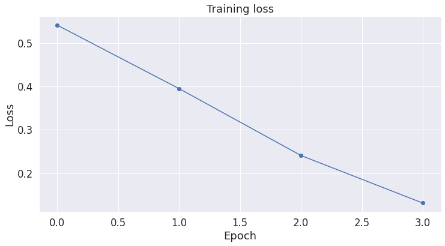
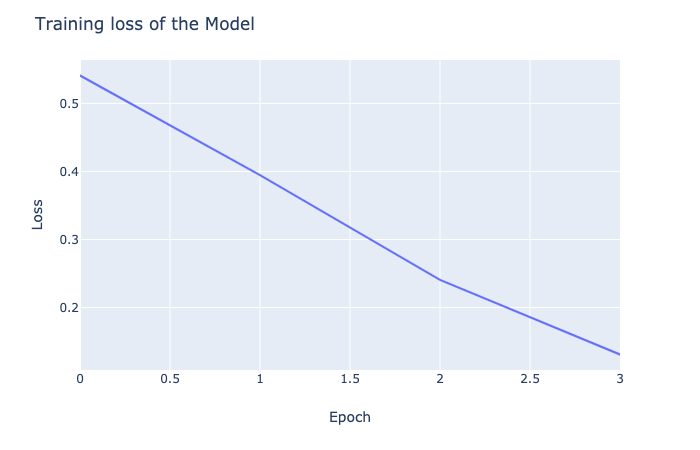

# UMC BERT Repo
BERT models' repo for UMC NLP researches

## How to use?
* You should git clone this repository first.
* And then cd into the folder, type as follows according to your cuda version and torch version.
```
sudo docker build --no-cache -f Dockerfile-py36-torch17-cuda102 -t pytorch_env/pytorch:1.7_py36_cu102 .
```
* For the pytorch headless script, you can use as the hereunder part.
```
sudo docker run --runtime=nvidia --ipc host --rm -it -v "$PWD":/home/workspace -w /home/workspace pytorch_env/pytorch:1.7_py36_cu102 python3 Albert_SOP_SUBMIT.py
# for Docker >= 19.03
sudo docker run --gpus all --ipc host --rm -it -v "$PWD":/home/workspace -w /home/workspace pytorch_env/pytorch:1.7_py36_cu102 python3 Albert_SOP_SUBMIT.py
```
* The pytorch jupyter notebook file `Albert_SOP_SUBMIT.ipynb` could be viewed under any jupyter notebook environment, but run under docker environment needs port forwording configurations on `dockers run`

## Pre-training data preparation
* The pre-training data should follow following folder structure
```
folder/
├── file_split_00
├── file_split_01
├── file_split_02
...
└── file_split_last
```
* each file should follw following file format, and the inputs are readed line by line
``` html
<doc id=SOME_IDs>
some plain texts line 1
some plain texts line 2
some plain texts line 3
....
some plain texts line last
</doc>
```
* Note: the OSCAR corpus is used for test-run, users can replace any corpus follow the format above

## Running Logs

### Pre-training

#### Initialization

    4.1.1
    AlbertConfig {
      "attention_probs_dropout_prob": 0,
      "bos_token_id": 2,
      "classifier_dropout_prob": 0.1,
      "embedding_size": 128,
      "eos_token_id": 3,
      "hidden_act": "gelu_new",
      "hidden_dropout_prob": 0,
      "hidden_size": 768,
      "initializer_range": 0.02,
      "inner_group_num": 1,
      "intermediate_size": 3072,
      "layer_norm_eps": 1e-12,
      "max_position_embeddings": 512,
      "model_type": "albert",
      "num_attention_heads": 12,
      "num_hidden_groups": 1,
      "num_hidden_layers": 12,
      "pad_token_id": 0,
      "position_embedding_type": "absolute",
      "type_vocab_size": 2,
      "vocab_size": 30522
    }


#### Load Dataset


    <transformers.data.datasets.language_modeling.LineByLineWithSOPTextDataset at 0x7f73f415f0f0>

    /home/qylin/.local/lib/python3.6/site-packages/transformers/data/data_collator.py:450: FutureWarning: DataCollatorForSOP is deprecated and will be removed in a future version, you can now use DataCollatorForLanguageModeling instead.
      FutureWarning,


#### Setup Trainer

    PyTorch: setting up devices


#### Training

    Using deprecated `--per_gpu_train_batch_size` argument which will be removed in a future version. Using `--per_device_train_batch_size` is preferred.
    Using deprecated `--per_gpu_train_batch_size` argument which will be removed in a future version. Using `--per_device_train_batch_size` is preferred.
    ***** Running training *****
      Num examples = 110027
      Num Epochs = 1
      Instantaneous batch size per device = 8
      Total train batch size (w. parallel, distributed & accumulation) = 32
      Gradient Accumulation steps = 1
      Total optimization steps = 3439
    Using deprecated `--per_gpu_train_batch_size` argument which will be removed in a future version. Using `--per_device_train_batch_size` is preferred.


<div>
    <style>
        /* Turns off some styling */
        progress {
            /* gets rid of default border in Firefox and Opera. */
            border: none;
            /* Needs to be in here for Safari polyfill so background images work as expected. */
            background-size: auto;
        }
    </style>

  <progress value='3439' max='3439' style='width:300px; height:20px; vertical-align: middle;'></progress>
  [3439/3439 24:52, Epoch 1/1]
</div>
<table border="1" class="dataframe">
<thead>
  <tr style="text-align: left;">
    <th>Step</th>
    <th>Training Loss</th>
  </tr>
</thead>
<tbody>
  <tr>
    <td>500</td>
    <td>8.702103</td>
  </tr>
  <tr>
    <td>1000</td>
    <td>6.757881</td>
  </tr>
  <tr>
    <td>1500</td>
    <td>6.533456</td>
  </tr>
  <tr>
    <td>2000</td>
    <td>6.494463</td>
  </tr>
  <tr>
    <td>2500</td>
    <td>6.476659</td>
  </tr>
  <tr>
    <td>3000</td>
    <td>6.468911</td>
  </tr>
</tbody>
</table><p>


    Training completed. Do not forget to share your model on huggingface.co/models =)


    TrainOutput(global_step=3439, training_loss=6.8479398620374745)

### Fine-tuning


    Downloading dataset...


#### Prepare dataset

    Number of training sentences: 8,551

<div>
<style scoped>
    .dataframe tbody tr th:only-of-type {
        vertical-align: middle;
    }

    .dataframe tbody tr th {
        vertical-align: top;
    }

    .dataframe thead th {
        text-align: right;
    }
</style>
<table border="1" class="dataframe">
  <thead>
    <tr style="text-align: right;">
      <th></th>
      <th>sentence_source</th>
      <th>label</th>
      <th>label_notes</th>
      <th>sentence</th>
    </tr>
  </thead>
  <tbody>
    <tr>
      <th>2389</th>
      <td>l-93</td>
      <td>1</td>
      <td>NaN</td>
      <td>Angela characterized Shelly as a lifesaver.</td>
    </tr>
    <tr>
      <th>5048</th>
      <td>ks08</td>
      <td>1</td>
      <td>NaN</td>
      <td>They're not finding it a stress being in the s...</td>
    </tr>
    <tr>
      <th>3133</th>
      <td>l-93</td>
      <td>0</td>
      <td>*</td>
      <td>Paul exhaled on Mary.</td>
    </tr>
    <tr>
      <th>5955</th>
      <td>c_13</td>
      <td>0</td>
      <td>*</td>
      <td>I ordered if John drink his beer.</td>
    </tr>
    <tr>
      <th>625</th>
      <td>bc01</td>
      <td>1</td>
      <td>NaN</td>
      <td>Press the stamp against the pad completely.</td>
    </tr>
    <tr>
      <th>3542</th>
      <td>ks08</td>
      <td>0</td>
      <td>*</td>
      <td>They can very.</td>
    </tr>
    <tr>
      <th>6915</th>
      <td>m_02</td>
      <td>1</td>
      <td>NaN</td>
      <td>This arch is supporting the weight of the tower.</td>
    </tr>
    <tr>
      <th>2908</th>
      <td>l-93</td>
      <td>1</td>
      <td>NaN</td>
      <td>That new handle detaches easily.</td>
    </tr>
    <tr>
      <th>5857</th>
      <td>c_13</td>
      <td>1</td>
      <td>NaN</td>
      <td>The Brazilians pumped the oil across the river.</td>
    </tr>
    <tr>
      <th>4191</th>
      <td>ks08</td>
      <td>1</td>
      <td>NaN</td>
      <td>It is a wooden desk.</td>
    </tr>
  </tbody>
</table>
</div>


#### Dataset Examples

<div>
<style scoped>
    .dataframe tbody tr th:only-of-type {
        vertical-align: middle;
    }

    .dataframe tbody tr th {
        vertical-align: top;
    }

    .dataframe thead th {
        text-align: right;
    }
</style>
<table border="1" class="dataframe">
  <thead>
    <tr style="text-align: right;">
      <th></th>
      <th>sentence</th>
      <th>label</th>
    </tr>
  </thead>
  <tbody>
    <tr>
      <th>6770</th>
      <td>We realised that Dr Jones died because he ate ...</td>
      <td>0</td>
    </tr>
    <tr>
      <th>1652</th>
      <td>Here's a pole for you to kiss the girl who tie...</td>
      <td>0</td>
    </tr>
    <tr>
      <th>3258</th>
      <td>Jennifer baked at the potatoes.</td>
      <td>0</td>
    </tr>
    <tr>
      <th>4651</th>
      <td>Kim is resembled by the model in nearly every ...</td>
      <td>0</td>
    </tr>
    <tr>
      <th>2672</th>
      <td>The book sent to Peter.</td>
      <td>0</td>
    </tr>
  </tbody>
</table>
</div>


#### Get the lists of sentences and their labels.

    array(["Our friends won't buy this analysis, let alone the next one we propose.",
           "One more pseudo generalization and I'm giving up.",
           "One more pseudo generalization or I'm giving up.", ...,
           'It is easy to slay the Gorgon.',
           'I had the strangest feeling that I knew you.',
           'What all did you get for Christmas?'], dtype=object)

####  Tokenization & Input Formatting

    loading file https://huggingface.co/albert-base-v2/resolve/main/spiece.model from cache at /home/qylin/.cache/huggingface/transformers/10be6ce6d3508f1fdce98a57a574283b47c055228c1235f8686f039287ff8174.d6110e25022b713452eb83d5bfa8ae64530995a93d8e694fe52e05aa85dd3a7d

#### Example tokenized sentence

     Original:  Our friends won't buy this analysis, let alone the next one we propose.
    Tokenized:  ['▁our', '▁friends', '▁won', "'", 't', '▁buy', '▁this', '▁analysis', ',', '▁let', '▁alone', '▁the', '▁next', '▁one', '▁we', '▁propose', '.']
    Token IDs:  [318, 954, 230, 22, 38, 3034, 48, 2495, 15, 408, 1056, 14, 328, 53, 95, 17873, 9]


#### Print sentence 0, now as a list of IDs.

    Original:  Our friends won't buy this analysis, let alone the next one we propose.
    Token IDs: [2, 318, 954, 230, 22, 38, 3034, 48, 2495, 15, 408, 1056, 14, 328, 53, 95, 17873, 9, 3]


#### Padding & Truncating

    Max sentence length:  46

    Padding/truncating all sentences to 64 values...

    Padding token: "<pad>", ID: 0

    Done.


#### Train Our Classification Model

#### Load the model we trained above

    loading configuration file https://huggingface.co/albert-base-v2/resolve/main/config.json from cache at /home/qylin/.cache/huggingface/transformers/e48be00f755a5f765e36a32885e8d6a573081df3321c9e19428d12abadf7dba2.b8f28145885741cf994c0e8a97b724f6c974460c297002145e48e511d2496e88
    Model config AlbertConfig {
      "architectures": [
        "AlbertForMaskedLM"
      ],
      "attention_probs_dropout_prob": 0,
      "bos_token_id": 2,
      "classifier_dropout_prob": 0.1,
      "down_scale_factor": 1,
      "embedding_size": 128,
      "eos_token_id": 3,
      "gap_size": 0,
      "hidden_act": "gelu_new",
      "hidden_dropout_prob": 0,
      "hidden_size": 768,
      "initializer_range": 0.02,
      "inner_group_num": 1,
      "intermediate_size": 3072,
      "layer_norm_eps": 1e-12,
      "max_position_embeddings": 512,
      "model_type": "albert",
      "net_structure_type": 0,
      "num_attention_heads": 12,
      "num_hidden_groups": 1,
      "num_hidden_layers": 12,
      "num_memory_blocks": 0,
      "pad_token_id": 0,
      "position_embedding_type": "absolute",
      "type_vocab_size": 2,
      "vocab_size": 30000
    }

    loading weights file https://huggingface.co/albert-base-v2/resolve/main/pytorch_model.bin from cache at /home/qylin/.cache/huggingface/transformers/bf1986d976e9a8320cbd3a0597e610bf299d639ce31b7ca581cbf54be3aaa6d3.d6d54047dfe6ae844e3bf6e7a7d0aff71cb598d3df019361e076ba7639b1da9b
    Some weights of the model checkpoint at albert-base-v2 were not used when initializing AlbertForSequenceClassification: ['predictions.bias', 'predictions.LayerNorm.weight', 'predictions.LayerNorm.bias', 'predictions.dense.weight', 'predictions.dense.bias', 'predictions.decoder.weight', 'predictions.decoder.bias']
    - This IS expected if you are initializing AlbertForSequenceClassification from the checkpoint of a model trained on another task or with another architecture (e.g. initializing a BertForSequenceClassification model from a BertForPreTraining model).
    - This IS NOT expected if you are initializing AlbertForSequenceClassification from the checkpoint of a model that you expect to be exactly identical (initializing a BertForSequenceClassification model from a BertForSequenceClassification model).
    Some weights of AlbertForSequenceClassification were not initialized from the model checkpoint at albert-base-v2 and are newly initialized: ['classifier.weight', 'classifier.bias']
    You should probably TRAIN this model on a down-stream task to be able to use it for predictions and inference.


    AlbertForSequenceClassification(
      (albert): AlbertModel(
        (embeddings): AlbertEmbeddings(
          (word_embeddings): Embedding(30000, 128, padding_idx=0)
          (position_embeddings): Embedding(512, 128)
          (token_type_embeddings): Embedding(2, 128)
          (LayerNorm): LayerNorm((128,), eps=1e-12, elementwise_affine=True)
          (dropout): Dropout(p=0, inplace=False)
        )
        (encoder): AlbertTransformer(
          (embedding_hidden_mapping_in): Linear(in_features=128, out_features=768, bias=True)
          (albert_layer_groups): ModuleList(
            (0): AlbertLayerGroup(
              (albert_layers): ModuleList(
                (0): AlbertLayer(
                  (full_layer_layer_norm): LayerNorm((768,), eps=1e-12, elementwise_affine=True)
                  (attention): AlbertAttention(
                    (query): Linear(in_features=768, out_features=768, bias=True)
                    (key): Linear(in_features=768, out_features=768, bias=True)
                    (value): Linear(in_features=768, out_features=768, bias=True)
                    (attention_dropout): Dropout(p=0, inplace=False)
                    (output_dropout): Dropout(p=0, inplace=False)
                    (dense): Linear(in_features=768, out_features=768, bias=True)
                    (LayerNorm): LayerNorm((768,), eps=1e-12, elementwise_affine=True)
                  )
                  (ffn): Linear(in_features=768, out_features=3072, bias=True)
                  (ffn_output): Linear(in_features=3072, out_features=768, bias=True)
                  (dropout): Dropout(p=0, inplace=False)
                )
              )
            )
          )
        )
        (pooler): Linear(in_features=768, out_features=768, bias=True)
        (pooler_activation): Tanh()
      )
      (dropout): Dropout(p=0.1, inplace=False)
      (classifier): Linear(in_features=768, out_features=2, bias=True)
    )

#### Get all of the model's parameters as a list of tuples.

    The BERT model has 27 different named parameters.

    ==== Embedding Layer ====

    albert.embeddings.word_embeddings.weight                (30000, 128)
    albert.embeddings.position_embeddings.weight              (512, 128)
    albert.embeddings.token_type_embeddings.weight              (2, 128)
    albert.embeddings.LayerNorm.weight                            (128,)
    albert.embeddings.LayerNorm.bias                              (128,)

    ==== First Transformer ====

    albert.encoder.embedding_hidden_mapping_in.weight         (768, 128)
    albert.encoder.embedding_hidden_mapping_in.bias               (768,)
    albert.encoder.albert_layer_groups.0.albert_layers.0.full_layer_layer_norm.weight       (768,)
    albert.encoder.albert_layer_groups.0.albert_layers.0.full_layer_layer_norm.bias       (768,)
    albert.encoder.albert_layer_groups.0.albert_layers.0.attention.query.weight   (768, 768)
    albert.encoder.albert_layer_groups.0.albert_layers.0.attention.query.bias       (768,)
    albert.encoder.albert_layer_groups.0.albert_layers.0.attention.key.weight   (768, 768)
    albert.encoder.albert_layer_groups.0.albert_layers.0.attention.key.bias       (768,)
    albert.encoder.albert_layer_groups.0.albert_layers.0.attention.value.weight   (768, 768)
    albert.encoder.albert_layer_groups.0.albert_layers.0.attention.value.bias       (768,)
    albert.encoder.albert_layer_groups.0.albert_layers.0.attention.dense.weight   (768, 768)
    albert.encoder.albert_layer_groups.0.albert_layers.0.attention.dense.bias       (768,)
    albert.encoder.albert_layer_groups.0.albert_layers.0.attention.LayerNorm.weight       (768,)
    albert.encoder.albert_layer_groups.0.albert_layers.0.attention.LayerNorm.bias       (768,)
    albert.encoder.albert_layer_groups.0.albert_layers.0.ffn.weight  (3072, 768)
    albert.encoder.albert_layer_groups.0.albert_layers.0.ffn.bias      (3072,)

    ==== Output Layer ====

    albert.pooler.weight                                      (768, 768)
    albert.pooler.bias                                            (768,)
    classifier.weight                                           (2, 768)
    classifier.bias                                                 (2,)


#### Optimizer & Learning Rate Scheduler

    <torch.optim.lr_scheduler.LambdaLR at 0x7f73f4141ac8>

#### Training Loop

    ======== Epoch 1 / 4 ========
    Training...
      Batch    40  of    241.    Elapsed: 0:00:07.
      Batch    80  of    241.    Elapsed: 0:00:15.
      Batch   120  of    241.    Elapsed: 0:00:22.
      Batch   160  of    241.    Elapsed: 0:00:29.
      Batch   200  of    241.    Elapsed: 0:00:37.
      Batch   240  of    241.    Elapsed: 0:00:44.

      Average training loss: 0.54
      Training epcoh took: 0:00:44

    Running Validation...
      Accuracy: 0.76
      Validation took: 0:00:02

    ======== Epoch 2 / 4 ========
    Training...
      Batch    40  of    241.    Elapsed: 0:00:07.
      Batch    80  of    241.    Elapsed: 0:00:15.
      Batch   120  of    241.    Elapsed: 0:00:22.
      Batch   160  of    241.    Elapsed: 0:00:29.
      Batch   200  of    241.    Elapsed: 0:00:37.
      Batch   240  of    241.    Elapsed: 0:00:44.

      Average training loss: 0.39
      Training epcoh took: 0:00:44

    Running Validation...
      Accuracy: 0.80
      Validation took: 0:00:02

    ======== Epoch 3 / 4 ========
    Training...
      Batch    40  of    241.    Elapsed: 0:00:07.
      Batch    80  of    241.    Elapsed: 0:00:15.
      Batch   120  of    241.    Elapsed: 0:00:22.
      Batch   160  of    241.    Elapsed: 0:00:30.
      Batch   200  of    241.    Elapsed: 0:00:37.
      Batch   240  of    241.    Elapsed: 0:00:45.

      Average training loss: 0.24
      Training epcoh took: 0:00:45

    Running Validation...
      Accuracy: 0.81
      Validation took: 0:00:02

    ======== Epoch 4 / 4 ========
    Training...
      Batch    40  of    241.    Elapsed: 0:00:08.
      Batch    80  of    241.    Elapsed: 0:00:15.
      Batch   120  of    241.    Elapsed: 0:00:23.
      Batch   160  of    241.    Elapsed: 0:00:31.
      Batch   200  of    241.    Elapsed: 0:00:38.
      Batch   240  of    241.    Elapsed: 0:00:46.

      Average training loss: 0.13
      Training epcoh took: 0:00:46

    Running Validation...
      Accuracy: 0.82
      Validation took: 0:00:02

    Training complete!



```python
loss_values

```

    [0.5410066298924047,
     0.3947033987562191,
     0.24058763440157369,
     0.13094004644737947]




### Performance On Test Set

#### Data Preparation

    Number of test sentences: 516

#### Evaluate on Test Set

    Predicting labels for 516 test sentences...
    DONE.

    Positive samples: 354 of 516 (68.60%)

    Calculating Matthews Corr. Coef. for each batch...


    /usr/local/lib/python3.6/dist-packages/scikit_learn-0.21.3-py3.6-linux-x86_64.egg/sklearn/metrics/classification.py:872: RuntimeWarning:

    invalid value encountered in double_scalars

    MCC: 0.522
